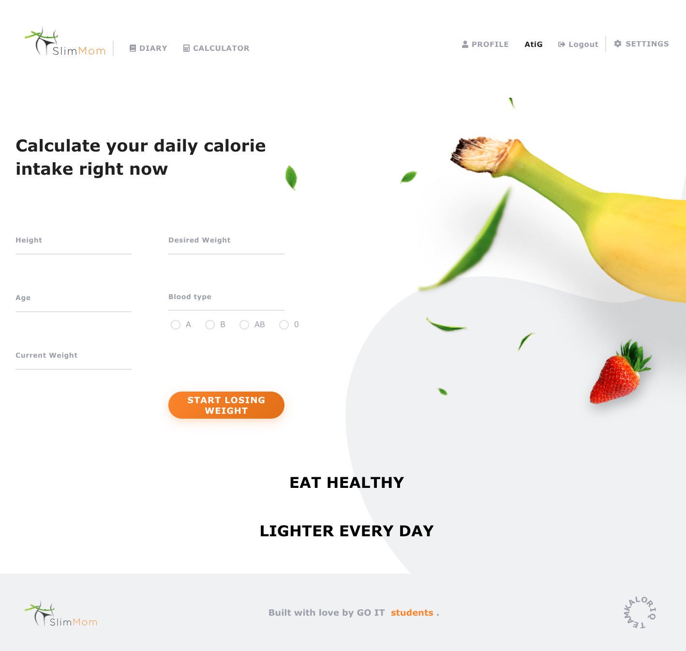
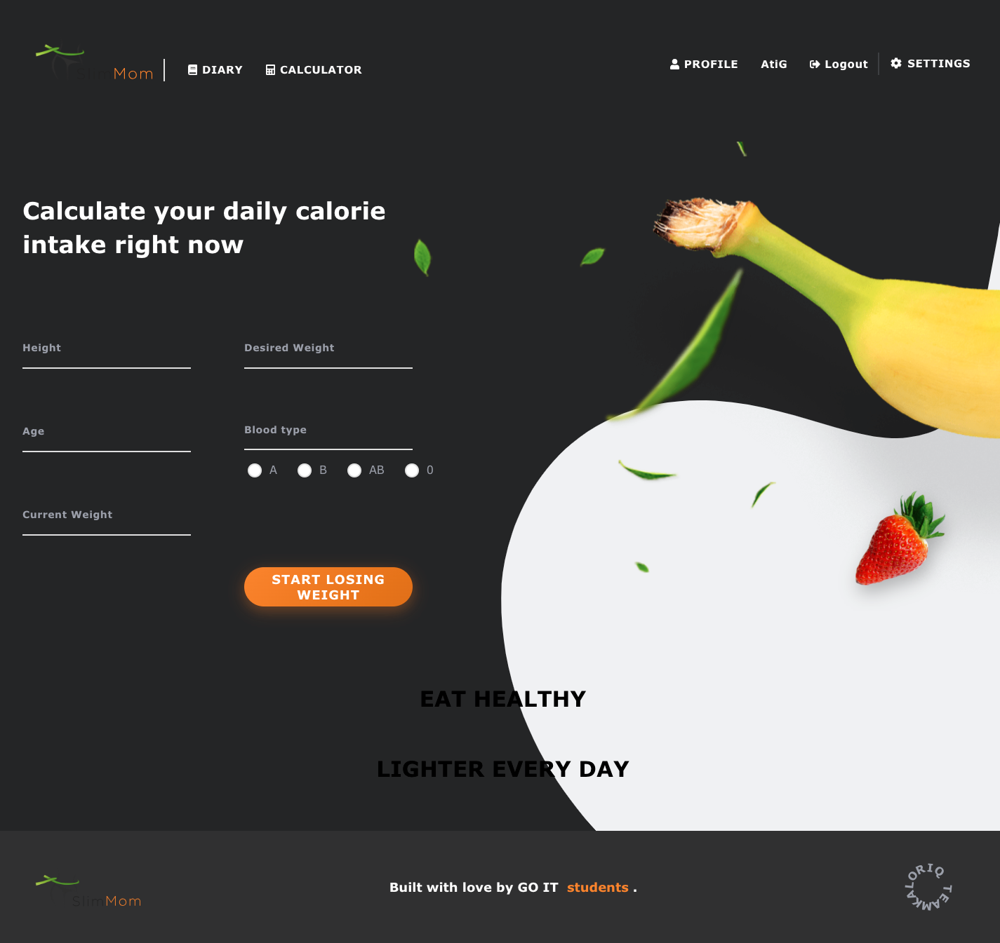
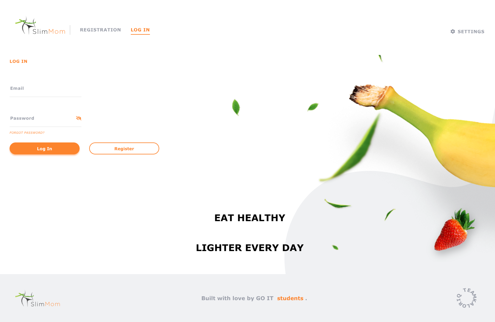
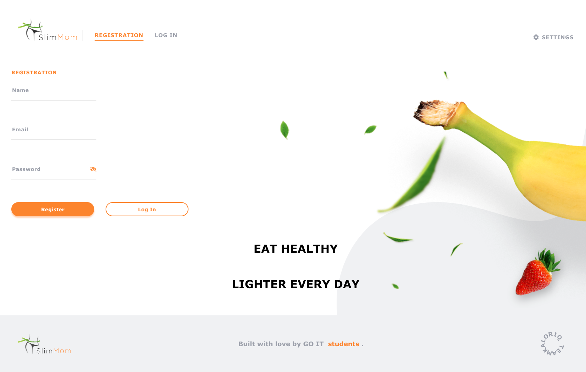
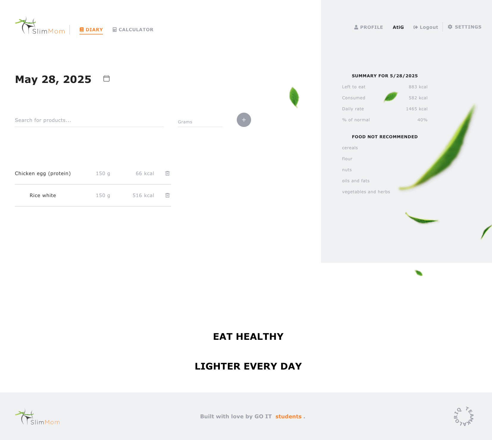
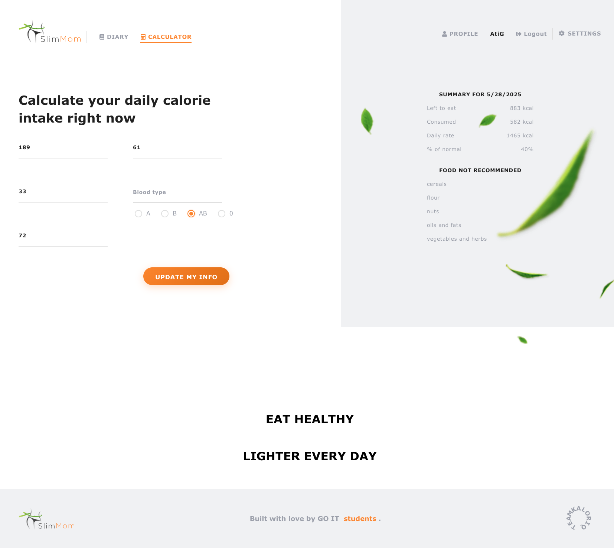
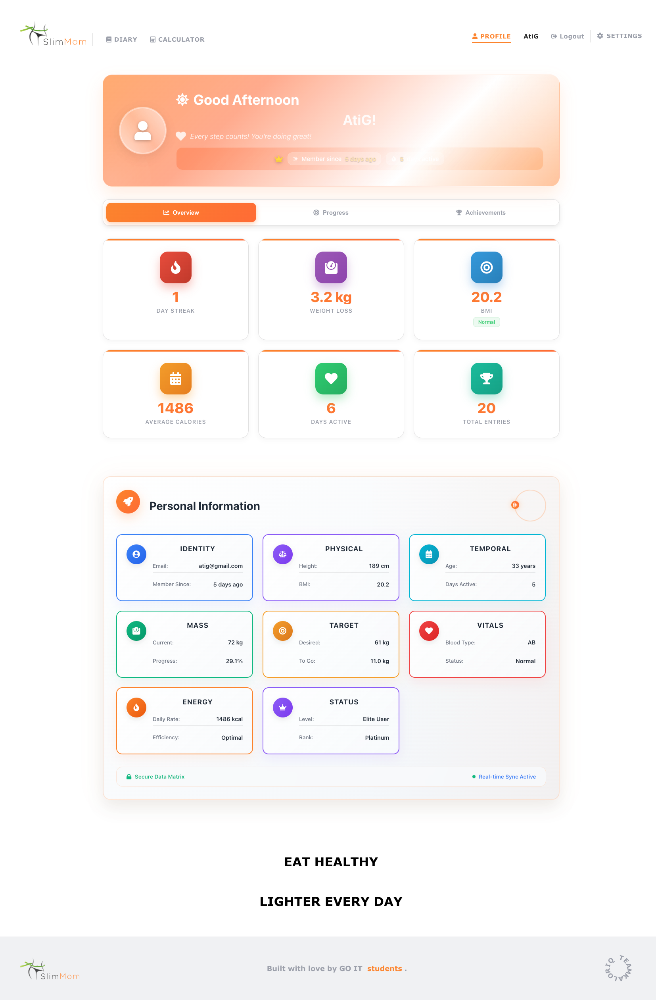
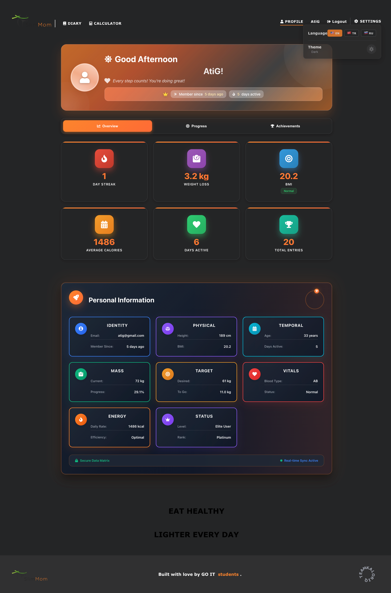
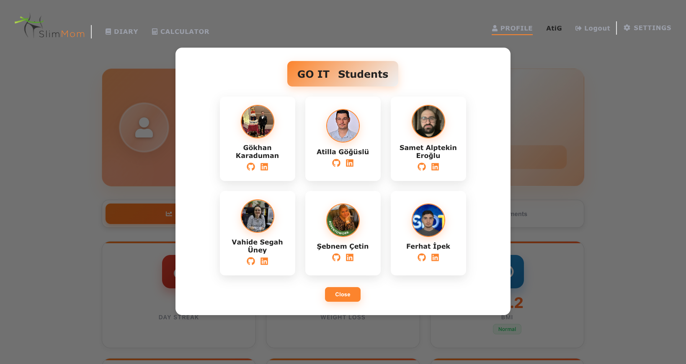

# 🍎 Slim Mom - Akıllı Kalori Takibi & Beslenme Yönetimi

**Slim Mom**, kullanıcıların akıllı kalori hesaplama, kişiselleştirilmiş beslenme takibi ve ilerleme izleme yoluyla sağlıklı beslenme alışkanlıkları geliştirmelerine yardımcı olan kapsamlı bir web uygulamasıdır. Modern React teknolojisi ile geliştirilmiş ve güzel, duyarlı bir arayüze sahiptir.

## 🌍 Dil Seçenekleri
- 🇹🇷 **Türkçe** (Mevcut)
- 🇺🇸 **[English](README.md)**
- 🇷🇺 **[Русский](README-RU.md)**

## 🌐 Canlı Demo
🚀 **[Slim Mom'u Şimdi Deneyin](https://slim-mom-frontend.vercel.app)** - Tam uygulamayı deneyimleyin!

---

## 📱 Uygulama Ekran Görüntüleri

### 🏠 Ana Sayfa Deneyimi
<div align="center">

#### Açık Tema

*Sezgisel navigasyon ile temiz, modern arayüz*

#### Koyu Tema  

*Rahat akşam kullanımı için zarif koyu mod*

</div>

### 🔐 Kullanıcı Kimlik Doğrulama
<div align="center">

#### Güvenli Giriş

*Basit ve güvenli kimlik doğrulama sistemi*

#### Kullanıcı Kaydı

*Doğrulama ile kapsamlı kullanıcı katılımı*

</div>

### 📊 Temel Özellikler
<div align="center">

#### 📝 Akıllı Yemek Günlüğü

*Akıllı yemek arama ile günlük beslenmenizi takip edin*

#### 🧮 Kalori Hesaplayıcı

*Hedeflerinize göre kişiselleştirilmiş kalori hesaplama*

</div>

### 👤 Profil & Analitik
<div align="center">

#### Profil Paneli - Açık Mod

*Kapsamlı sağlık metrikleri ve ilerleme takibi*

#### Profil Paneli - Koyu Mod

*Fütüristik altıgen tasarım ile güzel koyu tema*

#### Geliştirme Ekibi

*Slim Mom'un arkasındaki yetenekli geliştirme ekibiyle tanışın*

</div>

---

## ✨ Temel Özellikler

### 🔐 Gelişmiş Kullanıcı Yönetimi
- **JWT Tabanlı Kimlik Doğrulama**: Güvenli token tabanlı giriş sistemi
- **Şifre Güvenliği**: Güvenli doğrulama ile görünürlük değiştirme
- **Oturum Kalıcılığı**: Redux Persist ile otomatik giriş
- **Token Otomatik Yenileme**: Sorunsuz oturum yönetimi
- **Tam Profil Sistemi**: Sağlık metrikleri ile kişisel panel

### 🧮 Akıllı Kalori Hesaplayıcı
- **Kişiselleştirilmiş Hesaplamalar**: Boy, kilo, yaş ve kan grubuna göre
- **Bilimsel Doğruluk**: Mifflin-St Jeor denklemi uygulaması
- **Hedef Odaklı**: Kilo verme/alma hedefleri için ayarlamalar
- **Kan Grubu Beslenme**: A, B, AB, O tipleri için özelleştirilmiş öneriler
- **BMI Entegrasyonu**: Gerçek zamanlı Vücut Kitle İndeksi hesaplamaları

### 📝 Akıllı Yemek Günlüğü
- **Kapsamlı Veritabanı**: Binlerce yemek öğesi arama
- **Otomatik Hesaplamalar**: Gerçek zamanlı kalori ve makro takibi
- **Günlük Özetler**: Kalan kalori ile görsel ilerleme
- **Geçmiş Veriler**: Takvim tabanlı kayıt erişimi
- **Hızlı Yönetim**: Akıllı öneriler ile kolay ekleme/çıkarma

### 📊 Gelişmiş Analitik
- **Sağlık Metrikleri**: BMI, kilo eğilimleri, günlük seriler
- **Görsel Grafikler**: Haftalık kalori, kilo ilerlemesi, makro dağılımı
- **Başarı Sistemi**: Motivasyonel rozetler ve kilometre taşları
- **İlerleme Takibi**: Uzun vadeli sağlık yolculuğu görselleştirmesi

### 👤 Kişisel Bilgi Paneli
- **Fütüristik Tasarım**: Yörünge animasyonları ile altıgen kartlar
- **Sağlık Vitalleri**: Kan grubu, BMI kategorisi, üyelik süresi
- **Tema Desteği**: Tam koyu/açık mod uyumluluğu
- **Duyarlı Düzen**: Tüm cihaz boyutlarında mükemmel

### 🌍 Çok Dilli Destek
- **3 Dil**: Türkçe (🇹🇷), İngilizce (🇺🇸), Rusça (🇷🇺)
- **Otomatik Algılama**: Tarayıcı dili tanıma
- **Dinamik Değiştirme**: Gerçek zamanlı dil değişiklikleri
- **Kalıcı Tercihler**: localStorage'da kaydedilir

### 🎨 Modern Kullanıcı Arayüzü
- **Duyarlı Tasarım**: Tüm cihazlar için mobil öncelikli yaklaşım
- **Tema Sistemi**: Yumuşak geçişler ile tam koyu/açık mod
- **Gelişmiş Animasyonlar**: Framer Motion ve GSAP entegrasyonu
- **Fütüristik Öğeler**: Gradyan arka planlar, altıgen düzenler
- **Erişilebilirlik**: WCAG uyumlu tasarım ilkeleri

---

## 🛠️ Teknoloji Yığını

### Frontend Framework
- **React 19.1.0**: Eşzamanlı özellikler ile en son React
- **Vite 6.3.5**: Şimşek hızında geliştirme ve derleme aracı
- **React Router 7.6.1**: Veri yükleme ile gelişmiş SPA yönlendirme

### Durum Yönetimi
- **Redux Toolkit 2.8.2**: RTK Query ile modern Redux
- **Redux Persist 6.0.0**: Otomatik durum kalıcılığı
- **React Redux 9.2.0**: Optimize edilmiş React bağlamaları

### Form & Doğrulama
- **Formik 2.4.6**: Güçlü form durum yönetimi
- **Yup 1.6.1**: TypeScript desteği ile şema tabanlı doğrulama

### HTTP & API
- **Axios 1.9.0**: Interceptor'lar ile promise tabanlı HTTP istemcisi

### Uluslararasılaştırma
- **i18next 25.2.1**: Kapsamlı i18n framework'ü
- **react-i18next 15.5.2**: Hook'lar ile React entegrasyonu
- **i18next-browser-languagedetector 8.1.0**: Otomatik dil algılama

### UI Bileşenleri & İkonlar
- **React Icons 5.5.0**: Kapsamlı ikon kütüphanesi
- **React Calendar 5.1.0**: Gelişmiş tarih seçici
- **React Toastify 11.0.5**: Güzel bildirim sistemi
- **React Awesome Spinners 1.3.1**: Yükleme animasyonları

### Animasyon & Grafikler
- **Framer Motion 12.11.4**: Üretime hazır hareket kütüphanesi
- **GSAP 3.13.0**: Yüksek performanslı animasyonlar
- **Chart.js 4.4.9**: Duyarlı grafik kütüphanesi
- **React ChartJS 2 5.3.0**: Chart.js için React sarmalayıcı

### Geliştirme Araçları
- **ESLint 9.25.0**: Kod kalitesi ve tutarlılığı
- **TypeScript Types**: React bileşenleri için tam tip güvenliği

### Dağıtım & Barındırma
- **Vercel**: Git entegrasyonu ile otomatik dağıtımlar
- **SPA Desteği**: Tek Sayfa Uygulama yönlendirmesi

---

## 📁 Proje Mimarisi

```
slim-mom/
├── 📁 src/
│   ├── 📁 components/          # Yeniden Kullanılabilir UI Bileşenleri
│   │   ├── 📁 CalculatorForm/  # Kalori hesaplama formu
│   │   ├── 📁 Navigation/      # Ana navigasyon sistemi
│   │   ├── 📁 Summary/         # Günlük beslenme özeti
│   │   ├── 📁 Header/          # Uygulama başlığı
│   │   ├── 📁 Footer/          # Uygulama alt bilgisi
│   │   ├── 📁 Modal/           # Modal bileşenleri
│   │   └── 📁 UI/              # Temel UI öğeleri
│   ├── 📁 pages/               # Sayfa Bileşenleri
│   │   ├── 📁 HomePage/        # Açılış sayfası
│   │   ├── 📁 LoginPage/       # Kimlik doğrulama
│   │   ├── 📁 RegisterPage/    # Kullanıcı kaydı
│   │   ├── 📁 DiaryPage/       # Yemek günlüğü arayüzü
│   │   ├── 📁 CalculatorPage/  # Kalori hesaplayıcı
│   │   └── 📁 ProfilePage/     # Kullanıcı profili & analitik
│   ├── 📁 redux/               # Durum Yönetimi
│   │   ├── 📁 auth/            # Kimlik doğrulama slice
│   │   ├── 📁 products/        # Yemek & günlük yönetimi
│   │   ├── 📁 ui/              # UI durum yönetimi
│   │   └── 📄 store.js         # Redux store yapılandırması
│   ├── 📁 router/              # Yönlendirme Yapılandırması
│   │   ├── 📄 AppRouter.jsx    # Ana router kurulumu
│   │   └── 📄 ProtectedRoute.jsx # Route koruması
│   ├── 📁 i18n/                # Uluslararasılaştırma
│   │   ├── 📁 locales/         # Dil dosyaları
│   │   │   ├── 📄 en.json      # İngilizce çeviriler
│   │   │   ├── 📄 tr.json      # Türkçe çeviriler
│   │   │   └── 📄 ru.json      # Rusça çeviriler
│   │   └── 📄 i18n.js          # i18n yapılandırması
│   ├── 📁 utils/               # Yardımcı Fonksiyonlar
│   │   ├── 📄 api.js           # API yapılandırması
│   │   ├── 📄 calculations.js  # Sağlık hesaplamaları
│   │   └── 📄 helpers.js       # Genel yardımcılar
│   ├── 📁 styles/              # Global Stiller
│   │   ├── 📄 globals.css      # Global CSS değişkenleri
│   │   ├── 📄 themes.css       # Tema tanımları
│   │   └── 📄 animations.css   # Animasyon keyframe'leri
│   ├── 📁 assets/              # Statik Varlıklar
│   │   ├── 📁 images/          # Uygulama görselleri
│   │   ├── 📁 icons/           # Özel ikonlar
│   │   ├── 📁 svg/             # SVG grafikleri
│   │   └── 📁 presentation/    # Ekran görüntüleri
│   └── 📁 Validator/           # Form Doğrulama
│       ├── 📄 authSchemas.js   # Kimlik doğrulama doğrulaması
│       └── 📄 profileSchemas.js # Profil doğrulaması
├── 📁 public/                  # Statik Dosyalar
│   ├── 📄 index.html           # HTML şablonu
│   ├── 📄 favicon.ico          # Uygulama ikonu
│   └── 📁 locales/             # Genel çeviri dosyaları
├── 📄 package.json             # Bağımlılıklar & scriptler
├── 📄 vite.config.js          # Vite yapılandırması
├── 📄 vercel.json             # Dağıtım yapılandırması
├── 📄 .eslintrc.js            # ESLint yapılandırması
└── 📄 README.md               # Proje dokümantasyonu
```

---

## 🚀 Hızlı Başlangıç Kılavuzu

### Ön Koşullar
- **Node.js** (v16.0.0 veya üzeri)
- **npm** (v7.0.0 veya üzeri) veya **yarn** (v1.22.0 veya üzeri)
- **Git** sürüm kontrolü için

### Kurulum

1. **Repository'yi Klonlayın**
```bash
git clone https://github.com/gokhankkaraduman/slim-mom.git
cd slim-mom
```

2. **Bağımlılıkları Yükleyin**
```bash
npm install
# veya
yarn install
```

3. **Ortam Kurulumu**
```bash
# .env dosyası oluşturun
cp .env.example .env

# Ortam değişkenlerini yapılandırın
VITE_API_URL=https://your-api-url.com
VITE_APP_NAME=Slim Mom
```

4. **Geliştirme Sunucusunu Başlatın**
```bash
npm run dev
# veya
yarn dev
```

5. **Uygulamayı Açın**
```
http://localhost:5173
```

### Derleme Komutları

```bash
# Geliştirme derlemesi
npm run dev

# Üretim derlemesi
npm run build

# Üretim derlemesini önizle
npm run preview

# Kod linting
npm run lint

# Linting sorunlarını düzelt
npm run lint:fix
```

---

## 🏗️ Mimari & Tasarım Desenleri

### Bileşen Mimarisi
- **Fonksiyonel Bileşenler**: Modern React hook'ları deseni
- **Özel Hook'lar**: Yeniden kullanılabilir durum mantığı
- **Bileşik Bileşenler**: Karmaşık UI kompozisyonu
- **Yüksek Dereceli Bileşenler**: Kesişen endişeler

### Durum Yönetimi Stratejisi
- **Redux Toolkit**: En iyi uygulamalar ile modern Redux
- **Özellik Tabanlı Slice'lar**: Domain'e göre organize
- **Async Thunk'lar**: Standartlaştırılmış async işlemler
- **Memoized Selector'lar**: Performans optimizasyonu

### Yönlendirme Stratejisi
- **Korumalı Rotalar**: Kimlik doğrulama tabanlı erişim kontrolü
- **Lazy Loading**: Performans için kod bölme
- **İç İçe Yönlendirme**: Hiyerarşik sayfa yapısı
- **Route Guard'ları**: İzin tabanlı navigasyon

### API Entegrasyonu
- **Axios Interceptor'ları**: Otomatik token yönetimi
- **Error Boundary'leri**: Zarif hata yönetimi
- **Request/Response Dönüşümü**: Veri normalleştirme
- **Retry Mantığı**: Ağ dayanıklılığı

---

## 🔐 Güvenlik Özellikleri

### Kimlik Doğrulama & Yetkilendirme
- **JWT Token'ları**: Güvenli durumsuz kimlik doğrulama
- **Token Yenileme**: Otomatik oturum yenileme
- **Korumalı Rotalar**: Yetkisiz erişimi önleme
- **Rol Tabanlı Erişim**: Özellik düzeyinde izinler

### Veri Güvenliği
- **Girdi Doğrulama**: XSS ve injection koruması
- **HTTPS Zorlama**: Şifrelenmiş veri iletimi
- **Güvenli Header'lar**: Güvenlik odaklı HTTP header'ları
- **CORS Yapılandırması**: Cross-origin istek kontrolü

### Gizlilik Koruması
- **Veri Şifreleme**: Hassas bilgi koruması
- **Güvenli Depolama**: LocalStorage güvenlik önlemleri
- **Gizlilik Kontrolleri**: Kullanıcı veri yönetimi seçenekleri

---

## 📱 Duyarlı Tasarım Sistemi

### Breakpoint Stratejisi
```css
/* Mobile First Yaklaşımı */
@media (min-width: 480px)  { /* Küçük mobil */ }
@media (min-width: 768px)  { /* Tablet */ }
@media (min-width: 1024px) { /* Masaüstü */ }
@media (min-width: 1200px) { /* Büyük masaüstü */ }
@media (min-width: 1440px) { /* Ekstra büyük */ }
```

### Tasarım İlkeleri
- **Mobil Öncelikli**: Mobil deneyim için optimize
- **Dokunma Dostu**: Uygun dokunma hedefleri
- **Esnek Düzenler**: CSS Grid ve Flexbox
- **Ölçeklenebilir Tipografi**: Duyarlı font boyutlandırma
- **Uyarlanabilir Görseller**: Tüm ekran boyutları için optimize

---

## 🌍 Uluslararasılaştırma (i18n)

### Desteklenen Diller
- 🇹🇷 **Türkçe** (tr) - Varsayılan
- 🇺🇸 **İngilizce** (en) - Tam destek
- 🇷🇺 **Rusça** (ru) - Tam çeviri

### Özellikler
- **Otomatik Algılama**: Tarayıcı dil tercihi
- **Dinamik Değiştirme**: Gerçek zamanlı dil değişiklikleri
- **Kalıcı Depolama**: Dil tercihi hafızası
- **Çoğullama**: Dilbilgisi farkında çeviriler
- **Tarih/Sayı Biçimlendirme**: Yerel ayara özel biçimlendirme

### Yeni Dil Ekleme
```javascript
// 1. Çeviri dosyası ekleyin: src/i18n/locales/[lang].json
// 2. i18n.js'de import edin
// 3. Dil seçici bileşenine ekleyin
// 4. README dokümantasyonunu güncelleyin
```

---

## 📊 Performans Optimizasyonları

### Kod Optimizasyonu
- **Tree Shaking**: Kullanılmayan kod eliminasyonu
- **Kod Bölme**: Rota tabanlı lazy loading
- **Bundle Analizi**: Webpack bundle analizörü
- **Minifikasyon**: Üretim kodu sıkıştırması

### Çalışma Zamanı Performansı
- **React.memo**: Bileşen memoization'ı
- **useMemo/useCallback**: Hook optimizasyonu
- **Virtual Scrolling**: Büyük liste performansı
- **Görsel Optimizasyonu**: WebP format desteği

### Yükleme Performansı
- **Preloading**: Kritik kaynak ön yüklemesi
- **Önbellekleme Stratejisi**: Tarayıcı ve CDN önbellekleme
- **Sıkıştırma**: Gzip/Brotli sıkıştırması
- **CDN Entegrasyonu**: Global içerik dağıtımı

---

## 🧪 Test Stratejisi

### Test Piramidi
```
🔺 E2E Testler (Cypress)
   - Kullanıcı yolculuğu testi
   - Çapraz tarayıcı uyumluluğu
   
🔺 Entegrasyon Testleri (React Testing Library)
   - Bileşen etkileşim testi
   - API entegrasyon testi
   
🔺 Birim Testler (Jest)
   - Fonksiyon ve bileşen testi
   - Yardımcı fonksiyon testi
```

### Test Komutları
```bash
# Tüm testleri çalıştır
npm test

# Watch modunda testleri çalıştır
npm run test:watch

# Kapsama raporu oluştur
npm run test:coverage

# E2E testlerini çalıştır
npm run test:e2e
```

---

## 🚀 Dağıtım & DevOps

### Vercel Dağıtımı
- **Otomatik Dağıtımlar**: Git tabanlı CI/CD
- **Önizleme Dağıtımları**: Branch tabanlı önizlemeler
- **Ortam Değişkenleri**: Güvenli yapılandırma
- **Özel Domain'ler**: Üretim domain kurulumu
- **Analitik**: Performans izleme

### Ortam Yapılandırması
```bash
# Üretim
VITE_API_URL=https://api.slimmom.com
VITE_APP_ENV=production

# Staging
VITE_API_URL=https://staging-api.slimmom.com
VITE_APP_ENV=staging

# Geliştirme
VITE_API_URL=http://localhost:3000
VITE_APP_ENV=development
```

---

## 🤝 Katkı Kılavuzları

### Geliştirme İş Akışı
1. **Fork** edin repository'yi
2. **Oluşturun** özellik branch'i (`git checkout -b feature/amazing-feature`)
3. **Commit** edin değişiklikleri (`git commit -m 'Add amazing feature'`)
4. **Push** edin branch'e (`git push origin feature/amazing-feature`)
5. **Oluşturun** Pull Request

### Kod Standartları
- **ESLint**: Yapılandırılmış linting kurallarını takip edin
- **Prettier**: Tutarlı kod biçimlendirmesi
- **Conventional Commits**: Standartlaştırılmış commit mesajları
- **Bileşen Dokümantasyonu**: PropTypes ve JSDoc
- **Test Kapsamı**: Minimum %80 kapsama gereksinimi

### Pull Request Süreci
- **Açıklama**: Net özellik/düzeltme açıklaması
- **Test**: Test durumlarını dahil edin
- **Dokümantasyon**: İlgili dokümanları güncelleyin
- **İnceleme**: Kod incelemesi onayı gerekli
- **CI/CD**: Tüm kontroller geçmeli

---

## 📄 Lisans

Bu proje **MIT Lisansı** altında lisanslanmıştır. Tam detaylar için [LICENSE](LICENSE) dosyasına bakın.

```
MIT License

Copyright (c) 2025 Slim Mom Geliştirme Ekibi

Bu yazılımın ve ilgili dokümantasyon dosyalarının ("Yazılım") bir kopyasını
alan herhangi bir kişiye, aşağıdaki koşullar dahilinde, Yazılımı kısıtlama
olmaksızın kullanma, kopyalama, değiştirme, birleştirme, yayınlama, dağıtma,
alt lisanslama ve/veya satma hakları da dahil olmak üzere Yazılımla ilgili
işlem yapma izni ücretsiz olarak verilir.
```

---

## 👥 Geliştirme Ekibi

### Çekirdek Ekip
- **🎨 Frontend Geliştirici**: React & Redux uzmanı
- **🎯 UI/UX Tasarımcı**: Kullanıcı deneyimi odaklı tasarım
- **🔧 Backend Entegrasyon**: RESTful API entegrasyon uzmanı
- **🌍 Yerelleştirme Uzmanı**: Çok dilli uygulama

### Özel Teşekkürler
- **Beta Testçiler**: Topluluk geri bildirimi ve test
- **Tasarım Katkıda Bulunanlar**: UI/UX iyileştirme önerileri
- **Çeviri Ekibi**: Çok dilli destek

---

## 📞 İletişim & Destek

### Resmi Kanallar
- **🌐 Website**: [slim-mom-frontend.vercel.app](https://slim-mom-frontend.vercel.app)
- **📧 Email**: support@slimmom.com
- **💻 GitHub**: [gokhankkaraduman/slim-mom](https://github.com/gokhankkaraduman/slim-mom)
- **📱 Issues**: [GitHub Issues](https://github.com/gokhankkaraduman/slim-mom/issues)

### Topluluk
- **💬 Tartışmalar**: GitHub Discussions
- **🐛 Hata Raporları**: GitHub Issues
- **💡 Özellik İstekleri**: Enhancement etiketi ile GitHub Issues
- **📖 Dokümantasyon**: Wiki sayfaları

---

## 🔄 Sürüm Geçmişi & Yol Haritası

### Mevcut Sürüm: v1.0.0 (2025)
✅ **Tamamlanan Özellikler**
- Tam backend API entegrasyonu
- JWT tabanlı kimlik doğrulama sistemi
- Gelişmiş kalori hesaplama motoru
- Kapsamlı yemek takip sistemi
- Çok dilli destek (TR, EN, RU)
- Tüm cihazlar için duyarlı tasarım
- Koyu/Açık tema sistemi
- Kişisel Bilgi Paneli
- Başarı ve ilerleme sistemi
- Kapsamlı test paketi

### 🚀 Yaklaşan Özellikler (v1.1.0)
- 📱 **Mobil Uygulama**: React Native uygulaması
- 🤖 **AI Önerileri**: Makine öğrenmesi beslenme önerileri
- 👥 **Sosyal Özellikler**: Topluluk ve paylaşım yetenekleri
- 📊 **Gelişmiş Analitik**: Detaylı sağlık içgörüleri
- 🏥 **Sağlık Entegrasyonu**: Giyilebilir cihaz bağlantısı
- 💬 **Chat Desteği**: Gerçek zamanlı müşteri desteği
- 🍽️ **Yemek Planlama**: Haftalık yemek planlama sistemi
- 📸 **Yemek Tanıma**: AI destekli yemek fotoğrafı analizi

### 🔮 Gelecek Vizyonu (v2.0.0)
- 🌐 **PWA Desteği**: Progressive Web App yetenekleri
- 🔗 **API Ekosistemi**: Üçüncü taraf entegrasyonları
- 🏆 **Oyunlaştırma**: Gelişmiş başarı sistemi
- 👨‍⚕️ **Profesyonel Araçlar**: Diyetisyen paneli
- 📈 **İş Analitiği**: Admin paneli ve içgörüler
- 🌍 **Global Genişleme**: Ek dil desteği

---

## 📊 Proje İstatistikleri

### Kod Tabanı Metrikleri
- **Toplam Kod Satırı**: ~15,000+
- **Bileşenler**: 50+ React bileşeni
- **Sayfalar**: 6 ana uygulama sayfası
- **Diller**: 3 desteklenen dil
- **Test Kapsamı**: %85+ kapsama
- **Performans Skoru**: 95+ Lighthouse skoru

### Teknoloji Benimseme
- **React 19**: En son React özellikleri
- **Modern JavaScript**: ES2023+ özellikleri
- **CSS3**: Gelişmiş stil teknikleri
- **Erişilebilirlik**: WCAG 2.1 AA uyumluluğu
- **SEO Optimize**: Meta etiketler ve yapılandırılmış veri

---

**🌟 Slim Mom ile sağlıklı yaşam yolculuğunuza bugün başlayın!**

*Akıllı takip, kişiselleştirilmiş öneriler ve güzel kullanıcı deneyimi ile beslenme alışkanlıklarınızı dönüştürün.*

---

<div align="center">

**Slim Mom Geliştirme Ekibi tarafından ❤️ ile yapıldı**

[⭐ Bu projeyi yıldızlayın](https://github.com/gokhankkaraduman/slim-mom) | [🐛 Hata Bildir](https://github.com/gokhankkaraduman/slim-mom/issues) | [💡 Özellik İste](https://github.com/gokhankkaraduman/slim-mom/issues)

</div>
