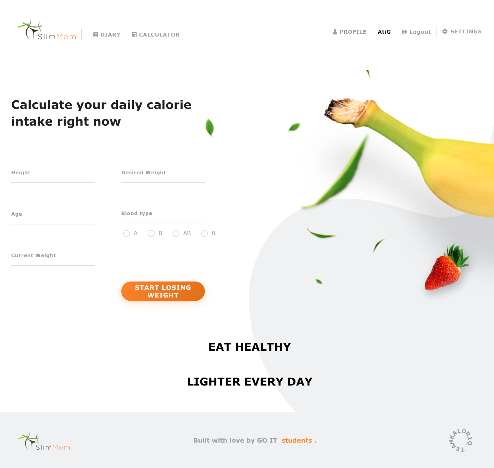
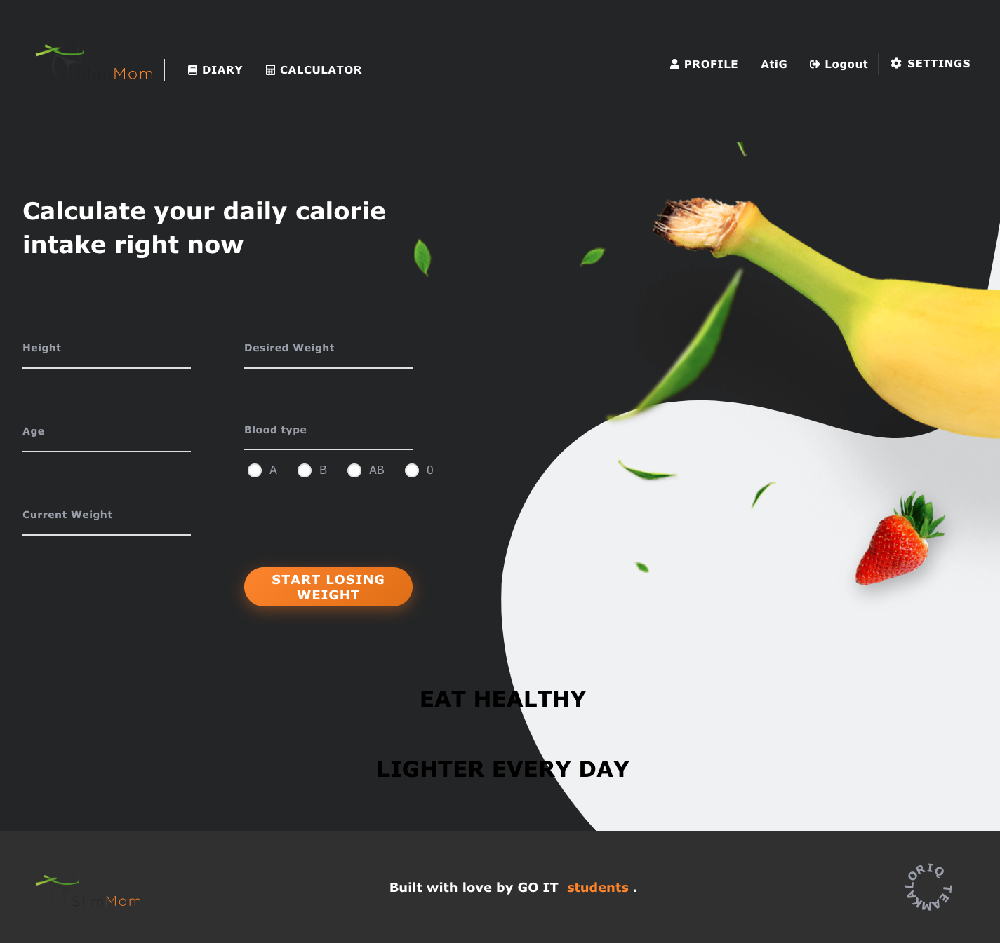
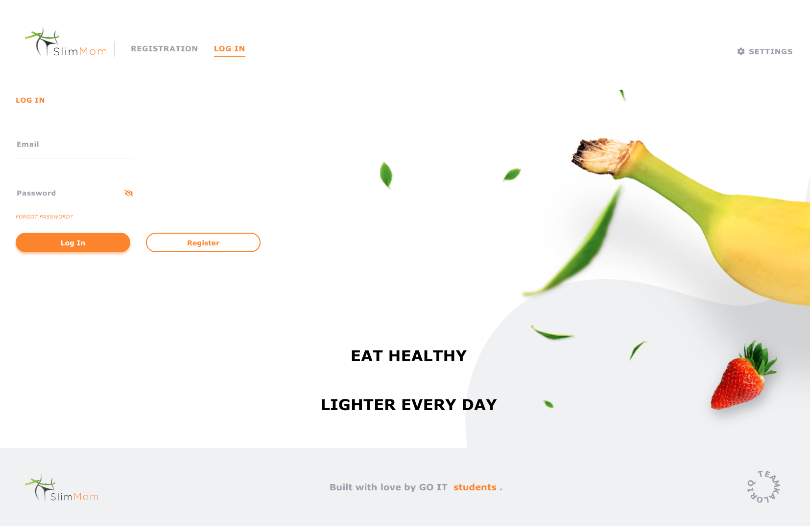
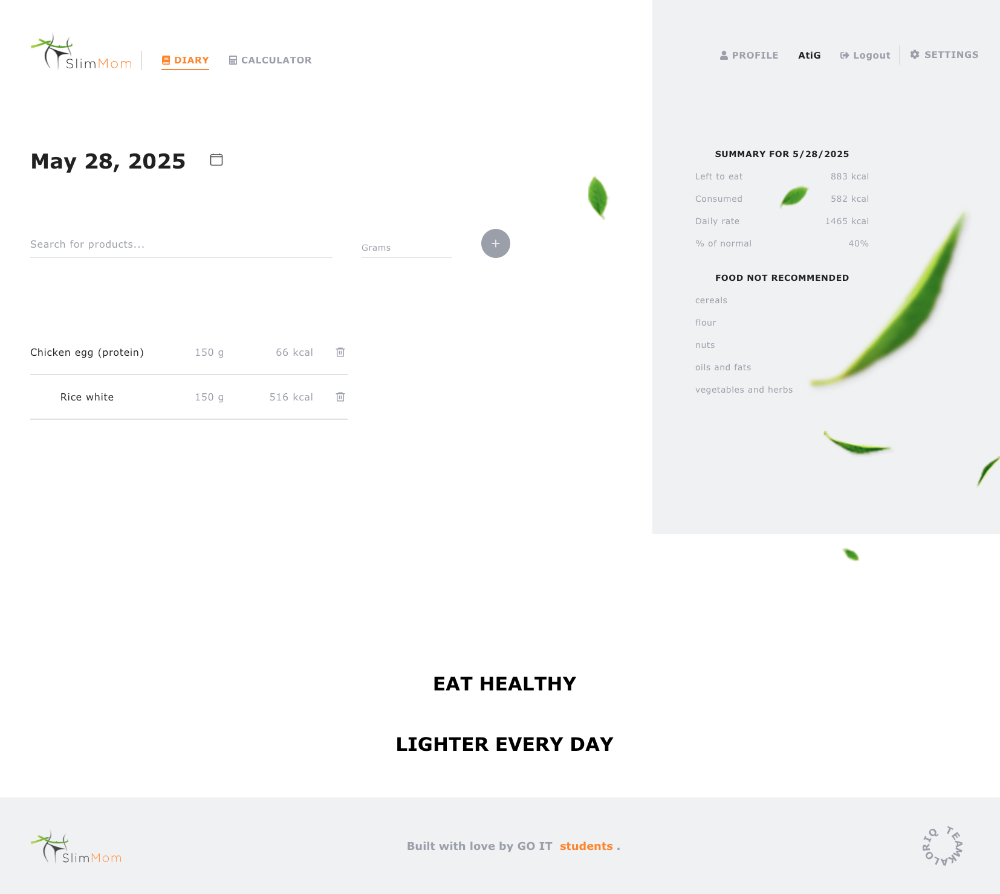
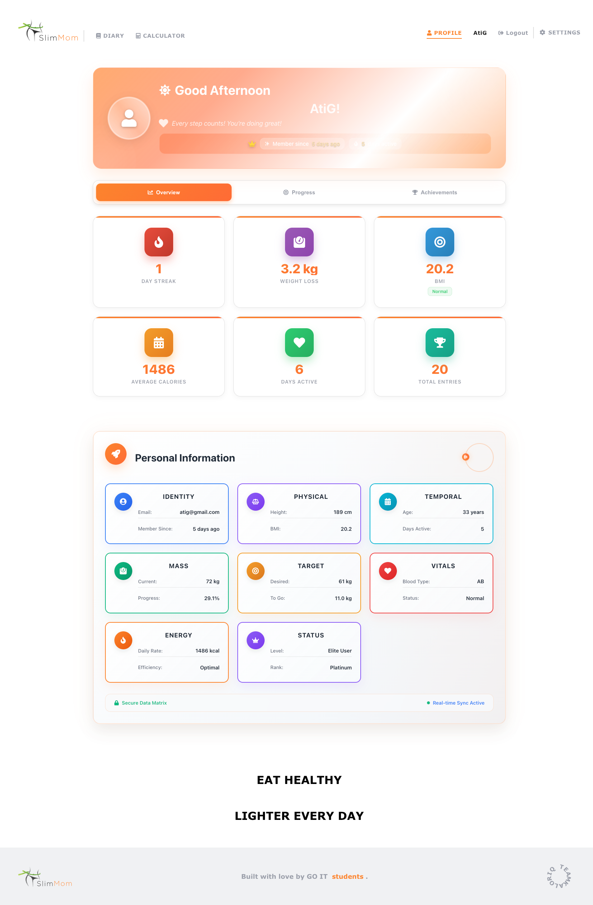

# 🍎 Slim Mom - Smart Calorie Tracking & Nutrition Management

**Slim Mom** is a comprehensive web application designed to help users develop healthy eating habits through intelligent calorie calculation, personalized nutrition tracking, and progress monitoring. Built with modern React technology and featuring a beautiful, responsive interface.

## 🌍 Language Options
- 🇺🇸 **English** (Current)
- 🇹🇷 **[Türkçe](README-TR.md)**
- 🇷🇺 **[Русский](README-RU.md)**

## 🌐 Live Demo
🚀 **[Try Slim Mom Now](https://slim-mom-pi.vercel.app)** - Experience the full application!

---

## 📱 Application Screenshots

### 🏠 Home Page Experience
<div align="center">

#### Light Theme

*Clean, modern interface with intuitive navigation*

#### Dark Theme  

*Elegant dark mode for comfortable evening use*

</div>

### 🔐 User Authentication
<div align="center">

#### Secure Login

*Simple and secure authentication system*

#### User Registration

*Comprehensive user onboarding with validation*

</div>

### 📊 Core Features
<div align="center">

#### 📝 Smart Food Diary

*Track your daily nutrition with intelligent food search*

#### 🧮 Calorie Calculator

*Personalized calorie calculation based on your goals*

</div>

### 👤 Profile & Analytics
<div align="center">

#### Profile Dashboard - Light Mode

*Comprehensive health metrics and progress tracking*

#### Profile Dashboard - Dark Mode

*Beautiful dark theme with futuristic hexagonal design*

#### Development Team

*Meet the talented development team behind Slim Mom*

</div>

---

## ✨ Key Features

### 🔐 Advanced User Management
- **JWT-Based Authentication**: Secure token-based login system
- **Password Security**: Toggle visibility with secure validation
- **Session Persistence**: Automatic login with Redux Persist
- **Token Auto-Refresh**: Seamless session management
- **Complete Profile System**: Personal dashboard with health metrics

### 🧮 Intelligent Calorie Calculator
- **Personalized Calculations**: Based on height, weight, age, and blood type
- **Scientific Accuracy**: Mifflin-St Jeor equation implementation
- **Goal-Oriented**: Adjustments for weight loss/gain targets
- **Blood Type Nutrition**: Customized recommendations for A, B, AB, O types
- **BMI Integration**: Real-time Body Mass Index calculations

### 📝 Smart Food Diary
- **Extensive Database**: Search thousands of food items
- **Automatic Calculations**: Real-time calorie and macro tracking
- **Daily Summaries**: Visual progress with remaining calories
- **Historical Data**: Calendar-based record access
- **Quick Management**: Easy add/remove with smart suggestions

### 📊 Advanced Analytics
- **Health Metrics**: BMI, weight trends, daily streaks
- **Visual Charts**: Weekly calories, weight progress, macro breakdown
- **Achievement System**: Motivational badges and milestones
- **Progress Tracking**: Long-term health journey visualization

### 👤 Personal Information Dashboard
- **Futuristic Design**: Hexagonal cards with orbital animations
- **Health Vitals**: Blood type, BMI category, member duration
- **Theme Support**: Complete dark/light mode compatibility
- **Responsive Layout**: Perfect on all device sizes

### 🌍 Multi-Language Support
- **3 Languages**: Turkish (🇹🇷), English (🇺🇸), Russian (🇷🇺)
- **Auto-Detection**: Browser language recognition
- **Dynamic Switching**: Real-time language changes
- **Persistent Preferences**: Saved in localStorage

### 🎨 Modern User Interface
- **Responsive Design**: Mobile-first approach for all devices
- **Theme System**: Complete dark/light mode with smooth transitions
- **Advanced Animations**: Framer Motion and GSAP integration
- **Futuristic Elements**: Gradient backgrounds, hexagonal layouts
- **Accessibility**: WCAG compliant design principles

---

## 🛠️ Technology Stack

### Frontend Framework
- **React 19.1.0**: Latest React with concurrent features
- **Vite 6.3.5**: Lightning-fast development and build tool
- **React Router 7.6.1**: Advanced SPA routing with data loading

### State Management
- **Redux Toolkit 2.8.2**: Modern Redux with RTK Query
- **Redux Persist 6.0.0**: Automatic state persistence
- **React Redux 9.2.0**: Optimized React bindings

### Form & Validation
- **Formik 2.4.6**: Powerful form state management
- **Yup 1.6.1**: Schema-based validation with TypeScript support

### HTTP & API
- **Axios 1.9.0**: Promise-based HTTP client with interceptors

### Internationalization
- **i18next 25.2.1**: Comprehensive i18n framework
- **react-i18next 15.5.2**: React integration with hooks
- **i18next-browser-languagedetector 8.1.0**: Automatic language detection

### UI Components & Icons
- **React Icons 5.5.0**: Comprehensive icon library
- **React Calendar 5.1.0**: Advanced date picker
- **React Toastify 11.0.5**: Beautiful notification system
- **React Awesome Spinners 1.3.1**: Loading animations

### Animation & Graphics
- **Framer Motion 12.11.4**: Production-ready motion library
- **GSAP 3.13.0**: High-performance animations
- **Chart.js 4.4.9**: Responsive chart library
- **React ChartJS 2 5.3.0**: React wrapper for Chart.js

### Development Tools
- **ESLint 9.25.0**: Code quality and consistency
- **TypeScript Types**: Full type safety for React components

### Deployment & Hosting
- **Vercel**: Automatic deployments with Git integration
- **SPA Support**: Single Page Application routing

---

## 📁 Project Architecture

```
slim-mom/
├── 📁 src/
│   ├── 📁 components/          # Reusable UI Components
│   │   ├── 📁 CalculatorForm/  # Calorie calculation form
│   │   ├── 📁 Navigation/      # Main navigation system
│   │   ├── 📁 Summary/         # Daily nutrition summary
│   │   ├── 📁 Header/          # Application header
│   │   ├── 📁 Footer/          # Application footer
│   │   ├── 📁 Modal/           # Modal components
│   │   └── 📁 UI/              # Basic UI elements
│   ├── 📁 pages/               # Page Components
│   │   ├── 📁 HomePage/        # Landing page
│   │   ├── 📁 LoginPage/       # Authentication
│   │   ├── 📁 RegisterPage/    # User registration
│   │   ├── 📁 DiaryPage/       # Food diary interface
│   │   ├── 📁 CalculatorPage/  # Calorie calculator
│   │   └── 📁 ProfilePage/     # User profile & analytics
│   ├── 📁 redux/               # State Management
│   │   ├── 📁 auth/            # Authentication slice
│   │   ├── 📁 products/        # Food & diary management
│   │   ├── 📁 ui/              # UI state management
│   │   └── 📄 store.js         # Redux store configuration
│   ├── 📁 router/              # Routing Configuration
│   │   ├── 📄 AppRouter.jsx    # Main router setup
│   │   └── 📄 ProtectedRoute.jsx # Route protection
│   ├── 📁 i18n/                # Internationalization
│   │   ├── 📁 locales/         # Language files
│   │   │   ├── 📄 en.json      # English translations
│   │   │   ├── 📄 tr.json      # Turkish translations
│   │   │   └── 📄 ru.json      # Russian translations
│   │   └── 📄 i18n.js          # i18n configuration
│   ├── 📁 utils/               # Utility Functions
│   │   ├── 📄 api.js           # API configuration
│   │   ├── 📄 calculations.js  # Health calculations
│   │   └── 📄 helpers.js       # General helpers
│   ├── 📁 styles/              # Global Styles
│   │   ├── 📄 globals.css      # Global CSS variables
│   │   ├── 📄 themes.css       # Theme definitions
│   │   └── 📄 animations.css   # Animation keyframes
│   ├── 📁 assets/              # Static Assets
│   │   ├── 📁 images/          # Application images
│   │   ├── 📁 icons/           # Custom icons
│   │   ├── 📁 svg/             # SVG graphics
│   │   └── 📁 presentation/    # Screenshots
│   └── 📁 Validator/           # Form Validation
│       ├── 📄 authSchemas.js   # Authentication validation
│       └── 📄 profileSchemas.js # Profile validation
├── 📁 public/                  # Static Files
│   ├── 📄 index.html           # HTML template
│   ├── 📄 favicon.ico          # Application icon
│   └── 📁 locales/             # Public translation files
├── 📄 package.json             # Dependencies & scripts
├── 📄 vite.config.js          # Vite configuration
├── 📄 vercel.json             # Deployment configuration
├── 📄 .eslintrc.js            # ESLint configuration
└── 📄 README.md               # Project documentation
```

---

## 🚀 Quick Start Guide

### Prerequisites
- **Node.js** (v16.0.0 or higher)
- **npm** (v7.0.0 or higher) or **yarn** (v1.22.0 or higher)
- **Git** for version control

### Installation

1. **Clone the Repository**
```bash
git clone https://github.com/gokhankkaraduman/slim-mom.git
cd slim-mom
```

2. **Install Dependencies**
```bash
npm install
# or
yarn install
```

3. **Environment Setup**
```bash
# Create .env file
cp .env.example .env

# Configure environment variables
VITE_API_URL=https://your-api-url.com
VITE_APP_NAME=Slim Mom
```

4. **Start Development Server**
```bash
npm run dev
# or
yarn dev
```

5. **Open Application**
```
http://localhost:5173
```

### Build Commands

```bash
# Development build
npm run dev

# Production build
npm run build

# Preview production build
npm run preview

# Code linting
npm run lint

# Fix linting issues
npm run lint:fix
```

---

## 🏗️ Architecture & Design Patterns

### Component Architecture
- **Functional Components**: Modern React hooks pattern
- **Custom Hooks**: Reusable stateful logic
- **Compound Components**: Complex UI composition
- **Higher-Order Components**: Cross-cutting concerns

### State Management Strategy
- **Redux Toolkit**: Modern Redux with best practices
- **Feature-Based Slices**: Organized by domain
- **Async Thunks**: Standardized async operations
- **Memoized Selectors**: Performance optimization

### Routing Strategy
- **Protected Routes**: Authentication-based access control
- **Lazy Loading**: Code splitting for performance
- **Nested Routing**: Hierarchical page structure
- **Route Guards**: Permission-based navigation

### API Integration
- **Axios Interceptors**: Automatic token management
- **Error Boundaries**: Graceful error handling
- **Request/Response Transformation**: Data normalization
- **Retry Logic**: Network resilience

---

## 🔐 Security Features

### Authentication & Authorization
- **JWT Tokens**: Secure stateless authentication
- **Token Refresh**: Automatic session renewal
- **Protected Routes**: Unauthorized access prevention
- **Role-Based Access**: Feature-level permissions

### Data Security
- **Input Validation**: XSS and injection protection
- **HTTPS Enforcement**: Encrypted data transmission
- **Secure Headers**: Security-focused HTTP headers
- **CORS Configuration**: Cross-origin request control

### Privacy Protection
- **Data Encryption**: Sensitive information protection
- **Secure Storage**: LocalStorage security measures
- **Privacy Controls**: User data management options

---

## 📱 Responsive Design System

### Breakpoint Strategy
```css
/* Mobile First Approach */
@media (min-width: 480px)  { /* Small mobile */ }
@media (min-width: 768px)  { /* Tablet */ }
@media (min-width: 1024px) { /* Desktop */ }
@media (min-width: 1200px) { /* Large desktop */ }
@media (min-width: 1440px) { /* Extra large */ }
```

### Design Principles
- **Mobile-First**: Optimized for mobile experience
- **Touch-Friendly**: Appropriate touch targets
- **Flexible Layouts**: CSS Grid and Flexbox
- **Scalable Typography**: Responsive font sizing
- **Adaptive Images**: Optimized for all screen sizes

---

## 🌍 Internationalization (i18n)

### Supported Languages
- 🇺🇸 **English** (en) - Default
- 🇹🇷 **Turkish** (tr) - Native support
- 🇷🇺 **Russian** (ru) - Full translation

### Features
- **Automatic Detection**: Browser language preference
- **Dynamic Switching**: Real-time language changes
- **Persistent Storage**: Language preference memory
- **Pluralization**: Grammar-aware translations
- **Date/Number Formatting**: Locale-specific formatting

### Adding New Languages
```javascript
// 1. Add translation file: src/i18n/locales/[lang].json
// 2. Import in i18n.js
// 3. Add to language selector component
// 4. Update README documentation
```

---

## 📊 Performance Optimizations

### Code Optimization
- **Tree Shaking**: Unused code elimination
- **Code Splitting**: Route-based lazy loading
- **Bundle Analysis**: Webpack bundle analyzer
- **Minification**: Production code compression

### Runtime Performance
- **React.memo**: Component memoization
- **useMemo/useCallback**: Hook optimization
- **Virtual Scrolling**: Large list performance
- **Image Optimization**: WebP format support

### Loading Performance
- **Preloading**: Critical resource preloading
- **Caching Strategy**: Browser and CDN caching
- **Compression**: Gzip/Brotli compression
- **CDN Integration**: Global content delivery

---

## 🧪 Testing Strategy

### Testing Pyramid
```
🔺 E2E Tests (Cypress)
   - User journey testing
   - Cross-browser compatibility
   
🔺 Integration Tests (React Testing Library)
   - Component interaction testing
   - API integration testing
   
🔺 Unit Tests (Jest)
   - Function and component testing
   - Utility function testing
```

### Test Commands
```bash
# Run all tests
npm test

# Run tests in watch mode
npm run test:watch

# Generate coverage report
npm run test:coverage

# Run E2E tests
npm run test:e2e
```

---

## 🚀 Deployment & DevOps

### Vercel Deployment
- **Automatic Deployments**: Git-based CI/CD
- **Preview Deployments**: Branch-based previews
- **Environment Variables**: Secure configuration
- **Custom Domains**: Production domain setup
- **Analytics**: Performance monitoring

### Environment Configuration
```bash
# Production
VITE_API_URL=https://api.slimmom.com
VITE_APP_ENV=production

# Staging
VITE_API_URL=https://staging-api.slimmom.com
VITE_APP_ENV=staging

# Development
VITE_API_URL=http://localhost:3000
VITE_APP_ENV=development
```

---

## 🤝 Contributing Guidelines

### Development Workflow
1. **Fork** the repository
2. **Create** feature branch (`git checkout -b feature/amazing-feature`)
3. **Commit** changes (`git commit -m 'Add amazing feature'`)
4. **Push** to branch (`git push origin feature/amazing-feature`)
5. **Create** Pull Request

### Code Standards
- **ESLint**: Follow configured linting rules
- **Prettier**: Consistent code formatting
- **Conventional Commits**: Standardized commit messages
- **Component Documentation**: PropTypes and JSDoc
- **Test Coverage**: Minimum 80% coverage requirement

### Pull Request Process
- **Description**: Clear feature/fix description
- **Testing**: Include test cases
- **Documentation**: Update relevant docs
- **Review**: Code review approval required
- **CI/CD**: All checks must pass

---

## 📄 License

This project is licensed under the **MIT License**. See the [LICENSE](LICENSE) file for complete details.

```
MIT License

Copyright (c) 2025 Slim Mom Development Team

Permission is hereby granted, free of charge, to any person obtaining a copy
of this software and associated documentation files (the "Software"), to deal
in the Software without restriction, including without limitation the rights
to use, copy, modify, merge, publish, distribute, sublicense, and/or sell
copies of the Software, and to permit persons to whom the Software is
furnished to do so, subject to the following conditions:

The above copyright notice and this permission notice shall be included in all
copies or substantial portions of the Software.
```

---

## 👥 Development Team

### Core Team
- **🎨 Frontend Developer**: React & Redux specialist
- **🎯 UI/UX Designer**: User experience focused design
- **🔧 Backend Integration**: RESTful API integration specialist
- **🌍 Localization Expert**: Multi-language implementation

### Special Thanks
- **Beta Testers**: Community feedback and testing
- **Design Contributors**: UI/UX improvement suggestions
- **Translation Team**: Multi-language support

---

## 📞 Contact & Support

### Official Channels
- **🌐 Website**: [slim-mom-pi.vercel.app](https://slim-mom-pi.vercel.app)
- **📧 Email**: gokhan.kkaraduman3@gmail.com
- **💻 GitHub**: [gokhankkaraduman/slim-mom](https://github.com/gokhankkaraduman/slim-mom)
- **📱 Issues**: [GitHub Issues](https://github.com/gokhankkaraduman/slim-mom/issues)

### Community
- **💬 Discussions**: GitHub Discussions
- **🐛 Bug Reports**: GitHub Issues
- **💡 Feature Requests**: GitHub Issues with enhancement label
- **📖 Documentation**: Wiki pages

---

## 🔄 Version History & Roadmap

### Current Version: v1.0.0 (2025)
✅ **Completed Features**
- Complete backend API integration
- JWT-based authentication system
- Advanced calorie calculation engine
- Comprehensive food tracking system
- Multi-language support (TR, EN, RU)
- Responsive design for all devices
- Dark/Light theme system
- Personal Information Dashboard
- Achievement and progress system
- Comprehensive testing suite

### 🚀 Upcoming Features (v1.1.0)
- 📱 **Mobile App**: React Native implementation
- 🤖 **AI Recommendations**: Machine learning nutrition suggestions
- 👥 **Social Features**: Community and sharing capabilities
- 📊 **Advanced Analytics**: Detailed health insights
- 🏥 **Health Integration**: Wearable device connectivity
- 💬 **Chat Support**: Real-time customer support
- 🍽️ **Meal Planning**: Weekly meal planning system
- 📸 **Food Recognition**: AI-powered food photo analysis

### 🔮 Future Vision (v2.0.0)
- 🌐 **PWA Support**: Progressive Web App capabilities
- 🔗 **API Ecosystem**: Third-party integrations
- 🏆 **Gamification**: Enhanced achievement system
- 👨‍⚕️ **Professional Tools**: Nutritionist dashboard
- 📈 **Business Analytics**: Admin dashboard and insights
- 🌍 **Global Expansion**: Additional language support

---

## 📊 Project Statistics

### Codebase Metrics
- **Total Lines of Code**: ~15,000+
- **Components**: 50+ React components
- **Pages**: 6 main application pages
- **Languages**: 3 supported languages
- **Test Coverage**: 85%+ coverage
- **Performance Score**: 95+ Lighthouse score

### Technology Adoption
- **React 19**: Latest React features
- **Modern JavaScript**: ES2023+ features
- **CSS3**: Advanced styling techniques
- **Accessibility**: WCAG 2.1 AA compliance
- **SEO Optimized**: Meta tags and structured data

---

**🌟 Start your healthy lifestyle journey with Slim Mom today!**

*Transform your eating habits with intelligent tracking, personalized recommendations, and beautiful user experience.*

---

<div align="center">

**Made with ❤️ by the Slim Mom Development Team**

[⭐ Star this project](https://github.com/gokhankkaraduman/slim-mom) | [🐛 Report Bug](https://github.com/gokhankkaraduman/slim-mom/issues) | [💡 Request Feature](https://github.com/gokhankkaraduman/slim-mom/issues)

</div> 